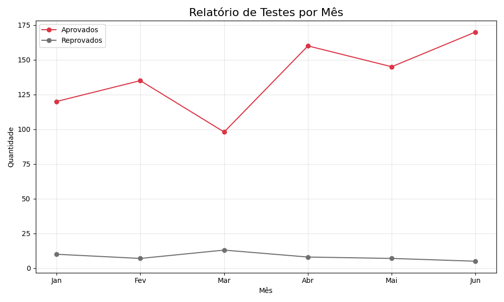

# 📊 Data Analysis Dashboard with Python

Este projeto realiza uma análise mensal de testes de software, calculando taxas de aprovação e gerando visualizações gráficas.

### Tecnologias
- **Python 3**
- **Pandas**: Manipulação e análise de dados.
- **Matplotlib**: Geração de gráficos de linha.

### Resultado

